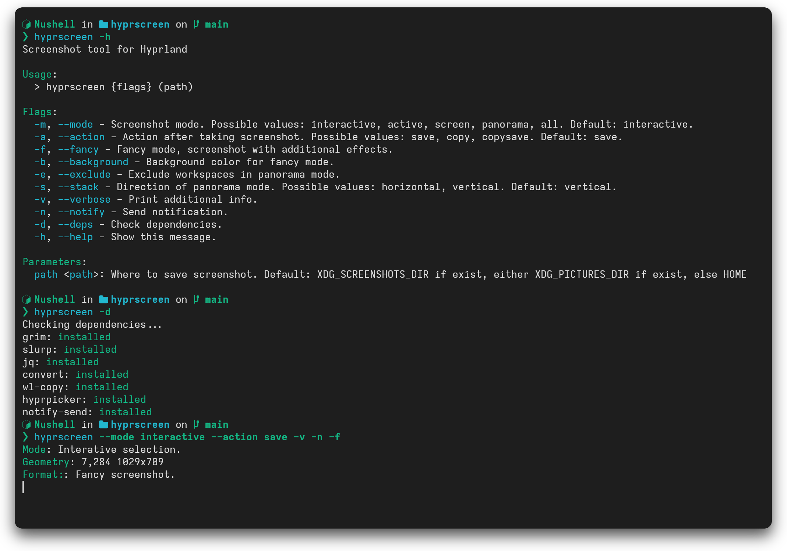

<div align="center">
    <h1> hyprscreen </h1>
</div>

**hyprscreen** - is a bash script for the Hyprland compositor that allows you to easily take screenshots in various modes and formats. It is also able to apply fancy post-processing such as padding, rounding and shadows.



## Features

#### Modes:

  - **Active**: take a quick screenshot of an active window.
  - **Screen**: select the monitor and take a screenshot of the entire screen.
  - **Interactive**: interactively select the entire screen, window or custom area.
  - **Panorama**: loop through workspaces and create a single image of them.
  - **All**: take screenshot of all outputs.

#### Formats:
  - **Simple**: simple screenshot with no effects.
  - **Fancy**: image with post-processing - shadows, padding and rounding.

#### Actions:
  - **Save**: save screenshot to custom or default path.
  - **Copy**: copy screenshot to clipboard using wl-copy.
  - **Copysave**: save screenshot and copy it to clipboard.


## Install

```sh
$ git clone https://github.com/Ligthiago/hyprscreen
$ cd hyprscreen
$ make install
```
or just copy the hyprscreen file to `~/.bin`.

For NixOS [this package](https://github.com/Ligthiago/novaFlake/blob/main/packages/hyprscreen/default.nix) can be used.

## Usage

```
Screenshot tool for Hyprland

Usage:
  > hyprscreen {flags} (path)

Flags:
  -m, --mode - Screenshot mode. Possible values: interactive, active, screen, panorama, all. Default: interactive.
  -a, --action - Action after taking screenshot. Possible values: save, copy, copysave. Default: save.
  -f, --fancy - Fancy mode, screenshot with additional effects.
  -b, --background - Background color for fancy mode.
  -e, --exclude - Exclude workspaces in panorama mode.
  -s, --stack - Direction of panorama mode. Possible values: horizontal, vertical. Default: vertical.
  -v, --verbose - Print additional info.
  -n, --notify - Send notification.
  -d, --deps - Check dependencies.
  -h, --help - Show this message.

Parameters:
  path <path>: Where to save screenshot. Default: XDG_SCREENSHOTS_DIR if exist, either XDG_PICTURES_DIR if exist, else HOME
```